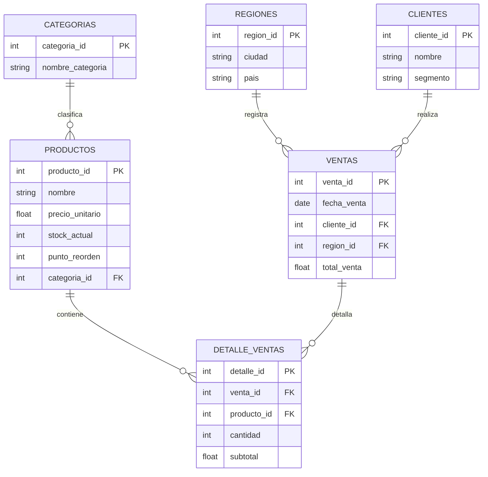

# S30 - Entrega 1: Entendimiento de la Necesidad EA1 (Mejorado)

**Estudiante:** Yonier Alexis Quiceno Rodríguez  
**Universidad:** IU Digital de Antioquia  
**Programa:** Ingeniería de Software y Datos  
**Grupo:** PREICA2601B020089 - Programación para Análisis de Datos  
**Docente:** Ana Maria Lopez  
**Fecha:** 31 de mayo de 2026

---

# 1. Definición de la Necesidad y Caso de Estudio

## 1.1 Caso de Estudio Seleccionado
El caso de estudio corresponde a **ShopAnalytics S.A.S.**, una empresa de comercio electrónico dedicada a la comercialización de productos de tecnología, hogar y moda a través de una plataforma digital a nivel nacional (Colombia). La empresa opera con miles de clientes activos y genera un flujo masivo de transacciones de venta diarias.

## 1.2 Problemática del Negocio
La organización enfrenta desafíos críticos en su cadena de suministro y almacenes:
* **Desabastecimiento (Stockout):** Pérdida de ventas activas en artículos de alta demanda.
* **Sobrestock (Overstock):** Capital de trabajo estancado y costos elevados de almacenamiento por productos de baja rotación.
* **Falta de Trazabilidad Geográfica:** Distribución ineficiente del stock entre las diferentes regiones del país, incrementando los costos logísticos de envío.

Para resolver esto, la gerencia requiere un modelo de análisis de datos estructurado y escalable, fundamentado en la metodología **CRISP-DM**, que permita tomar decisiones preventivas y correctivas basadas en datos transaccionales históricos.

---

# 2. Necesidad del Negocio y Objetivos Analíticos

## 2.1 Objetivo General
Desarrollar un modelo analítico y relacional de datos bajo la metodología **CRISP-DM** para optimizar la gestión del inventario de ShopAnalytics S.A.S., minimizando pérdidas económicas y mejorando la disponibilidad de productos en todas las zonas operativas.

## 2.2 Objetivos Específicos e Indicadores Medibles (KPIs)
Para garantizar la efectividad del proyecto, se definen los siguientes indicadores clave de rendimiento con metas cuantitativas concretas a alcanzar en un periodo de 6 meses:

1. **Reducción de Sobrestock (Overstock):**
   * **KPI:** Porcentaje de capital inmovilizado en inventario de baja rotación.
   * **Meta:** Disminuir el sobrestock en un **15%** mediante alertas automáticas de estancamiento.
2. **Disminución de Productos Agotados (Stockout):**
   * **KPI:** Tasa de quiebre de stock en productos categoría A (alta demanda).
   * **Meta:** Reducir los incidentes de desabastecimiento en un **20%** utilizando alertas preventivas de punto de reorden.
3. **Aumento de la Rotación de Inventario:**
   * **KPI:** Índice de rotación anual (Costo de ventas dividido por el inventario promedio).
   * **Meta:** Incrementar la rotación de **4 a 6 veces al año**, agilizando el flujo de caja del negocio.
4. **Mejora en la Disponibilidad Regional:**
   * **KPI:** Nivel de servicio de entrega (SLA) y disponibilidad local de stock regional.
   * **Meta:** Mantener una disponibilidad mínima del **95%** en las regiones clave (Andina, Caribe, Pacífica), reduciendo los tiempos de despacho cruzado.

---

# 3. Requerimientos del Negocio

| N° | Requerimiento | Descripción | Prioridad |
|---|---|---|---|
| R1 | Integración masiva de datos | Consolidar datos transaccionales en un motor de base de datos relacional para analítica. | Alta |
| R2 | Modelo Relacional Normalizado | Diseñar e implementar un esquema físico normalizado con llaves primarias y foráneas que elimine la redundancia. | Alta |
| R3 | Control de Inventario Activo | Incorporar variables de control de inventario (`stock_actual`, `punto_reorden`) en el catálogo de productos. | Alta |
| R4 | Consultas de Toma de Decisiones | Implementar reportes analíticos SQL específicos que identifiquen alertas de reabastecimiento, sobrestock, rotación de categorías y geografía de ventas. | Alta |
| R5 | Validaciones de Calidad y Calibración | Desarrollar rutinas automáticas en Python para certificar la integridad referencial y de almacenamiento de los datos. | Media |

---

# 4. Identificación y Claridad de las Fuentes de Datos

## 4.1 Declaración de Origen de Datos (Transparencia)
> [!IMPORTANT]
> **Aclaración sobre el origen de los datos:** Con el fin de mitigar cualquier confusión, se declara de forma transparente que los datos utilizados en esta fase son **100% simulados sintéticamente** mediante algoritmos implementados en Python (utilizando `Pandas` y `NumPy`). 
> 
> Esta simulación recrea de manera exacta el comportamiento transaccional del comercio electrónico real en Colombia (distribución de precios, estacionalidades de ventas por regiones y hábitos de compra), generando un volumen de **más de 5,000 registros de ventas** y **más de 10,000 detalles de tickets**. La mención a Kaggle o Datos Abiertos corresponde a un marco de referencia metodológico y de comparación para el posterior escalamiento del sistema a gran escala en producción.

## 4.2 Fuentes Estructuradas del Proyecto

| Fuente | Naturaleza | Datos Contenidos | Formato / Tecnología |
|---|---|---|---|
| **Simulador Transaccional Python** | Interna / Generada | Historial de transacciones de ventas, catálogo de productos con precios y puntos de seguridad de stock, datos demográficos de clientes y regiones colombianas. | Memoria / Pandas DataFrames |
| **Base de Datos Local Analítica** | Interna / Destino Local | Estructura relacional indexada que almacena las tablas normalizadas y permite consultas ágiles en tiempo real. | **SQLite (`shopanalytics.db`)** |
| **Base de Datos Cloud Corporativa** | Externa / Destino Cloud | Motor empresarial robusto en la nube para soportar integraciones con Power BI y almacenamiento masivo de Web Scraping de mercado (BBC Mundo). | **PostgreSQL (Google Cloud SQL)** |

---

# 5. Modelo de Datos y Arquitectura de Almacenamiento

## 5.1 Alineación y Coherencia Tecnológica (SQLite vs PostgreSQL)
Para evitar inconsistencias documentales, se detalla la justificación técnica de la arquitectura de almacenamiento dual:
* **Entorno de Desarrollo Local e Informe Académico (SQLite):** Se selecciona **SQLite3** como motor analítico de base de datos local embebida. Esto elimina barreras de infraestructura para el docente en la revisión del proyecto, garantizando portabilidad absoluta (`shopanalytics.db` es un único archivo físico portable), rapidez extrema y ejecución autónoma en entornos interactivos (Jupyter Notebook / Google Colab) sin requerir servicios de red o credenciales de servidor externos.
* **Entorno de Producción e Integración Corporativa (PostgreSQL):** Se proyecta y define el modelo físico en **PostgreSQL** para la fase 2 (Scraping de Noticias y Machine Learning NLP/SVM). La robustez de PostgreSQL permite manejar flujos concurrentes, integraciones directas con dashboards empresariales en Power BI y almacenamiento optimizado para texto no estructurado masivo (`TEXT`). Ambos esquemas comparten las mismas definiciones lógicas y relaciones SQL.

## 5.2 Esquema Físico de Base de Datos y Entidades
Se introduce el modelo de base de datos normalizado (Forma Normal 3NF) enriquecido con controles de inventario:



### Detalle de Atributos Críticos
* `PRODUCTOS.stock_actual`: Cantidad física real disponible en el almacén central.
* `PRODUCTOS.punto_reorden`: Nivel de inventario de seguridad. Si `stock_actual <= punto_reorden`, se dispara automáticamente una solicitud de reposición al proveedor.

---

# 6. Conexión, Carga de Datos y Evidencia de Ejecución

El script automatizado `src/ea1.py` genera, valida e ingesta los datos simulados en la base de datos local SQLite.

## 6.1 Rutinas de Validación de Integridad de Datos (Calidad)
Antes de ejecutar los reportes analíticos, el pipeline ejecuta pruebas automáticas de integridad física de la base de datos para garantizar la excelencia del modelo:
1. **Validación de Conteo de Tablas:** Corrobora que todos los registros de los DataFrames de Pandas (maestros y transaccionales) coincidan exactamente con la cantidad de filas persistidas en SQLite.
2. **Validación de Unicidad de Llaves Primarias (PK):** Chequea que no existan valores duplicados ni nulos en las columnas clave (`cliente_id`, `region_id`, `categoria_id`, `producto_id`, `venta_id`, `detalle_id`).
3. **Validación de Integridad Referencial (Llaves Foráneas):** Asegura que no existan registros huérfanos. Verifica que todo ID foráneo en `Ventas` y `Detalle_Ventas` tenga su correspondiente fila en la tabla maestra.

---

# 7. Consultas Analíticas Orientadas a la Toma de Decisiones

Para conectar directamente la información técnica con la estrategia directiva y los KPIs declarados, se implementan **4 consultas analíticas avanzadas**:

### Consulta A: Alerta Preventiva de Reabastecimiento (Evita Stockouts)
* **Objetivo de Negocio:** Habilitar compras ágiles. Identifica productos críticos cuyo inventario actual es menor o igual al punto de seguridad.
* **Consulta SQL:**
  ```sql
  SELECT 
      p.producto_id, p.nombre AS Producto, c.nombre_categoria AS Categoria,
      p.stock_actual AS Stock_Disponible, p.punto_reorden AS Nivel_Seguridad,
      (p.punto_reorden - p.stock_actual) AS Deficit_a_Pedir
  FROM Productos p
  JOIN Categorias c ON p.categoria_id = c.categoria_id
  WHERE p.stock_actual <= p.punto_reorden
  ORDER BY Deficit_a_Pedir DESC;
  ```
* **Acción Directiva:** Generar solicitudes automáticas de compra prioritarias a proveedores para los productos en rojo.

### Consulta B: Alerta de Riesgo de Estancamiento y Sobrestock
* **Objetivo de Negocio:** Reducir costos de almacenamiento inmovilizado. Detecta productos con inventario abundante en almacén pero muy bajas ventas.
* **Consulta SQL:**
  ```sql
  SELECT 
      p.nombre AS Producto, p.stock_actual AS Stock_Almacenado,
      COALESCE(SUM(d.cantidad), 0) AS Unidades_Vendidas,
      (p.stock_actual - COALESCE(SUM(d.cantidad), 0)) AS Inventario_Excedente
  FROM Productos p
  LEFT JOIN Detalle_Ventas d ON p.producto_id = d.producto_id
  GROUP BY p.producto_id
  HAVING Unidades_Vendidas < 15 AND Stock_Almacenado > 50
  ORDER BY Stock_Almacenado DESC;
  ```
* **Acción Directiva:** Lanzar campañas de descuento, promociones tipo combo o redireccionamiento comercial para liberar este inventario ocioso.

### Consulta C: Rotación e Ingresos por Categoría de Productos
* **Objetivo de Negocio:** Optimizar la asignación de espacios físicos en los almacenes según la popularidad de las familias de productos.
* **Consulta SQL:**
  ```sql
  SELECT 
      c.nombre_categoria AS Categoria,
      COUNT(DISTINCT v.venta_id) AS Transacciones,
      SUM(d.cantidad) AS Unidades_Vendidas,
      SUM(d.subtotal) AS Ingresos_Totales
  FROM Detalle_Ventas d
  JOIN Ventas v ON d.venta_id = v.venta_id
  JOIN Productos p ON d.producto_id = p.producto_id
  JOIN Categorias c ON p.categoria_id = c.categoria_id
  GROUP BY c.nombre_categoria
  ORDER BY Unidades_Vendidas DESC;
  ```
* **Acción Directiva:** Posicionar físicamente las categorías líderes más cerca de los muelles de carga rápidos para agilizar los despachos y optimizar recursos humanos.

### Consulta D: Concentración Geográfica de Ventas para Distribución Regional
* **Objetivo de Negocio:** Decidir en qué ciudades clave se deben abrir minihubs o centros de distribución secundarios para optimizar envíos.
* **Consulta SQL:**
  ```sql
  SELECT 
      r.ciudad AS Ciudad, r.pais AS Pais,
      COUNT(DISTINCT v.venta_id) AS Cantidad_Pedidos,
      SUM(v.total_venta) AS Facturacion_Total
  FROM Ventas v
  JOIN Regiones r ON v.region_id = r.region_id
  GROUP BY r.ciudad
  ORDER BY Facturacion_Total DESC;
  ```
* **Acción Directiva:** Direccionar campañas de publicidad localizadas en regiones rezagadas y pre-distribuir inventario en bodegas regionales secundarias según la demanda local estimada.

---

# 8. Recursos y Evidencias
* **Código de Ejecución Consolidado:** `src/ea1.py`
* **Base de Datos Local Generada:** `shopanalytics.db`
* **Jupyter Notebook Mejorado:** `docs/Quiceno_Rodriguez_Yonier_Alexis_Entendimiento_Necesidad_EA1_Mejorado.ipynb`
