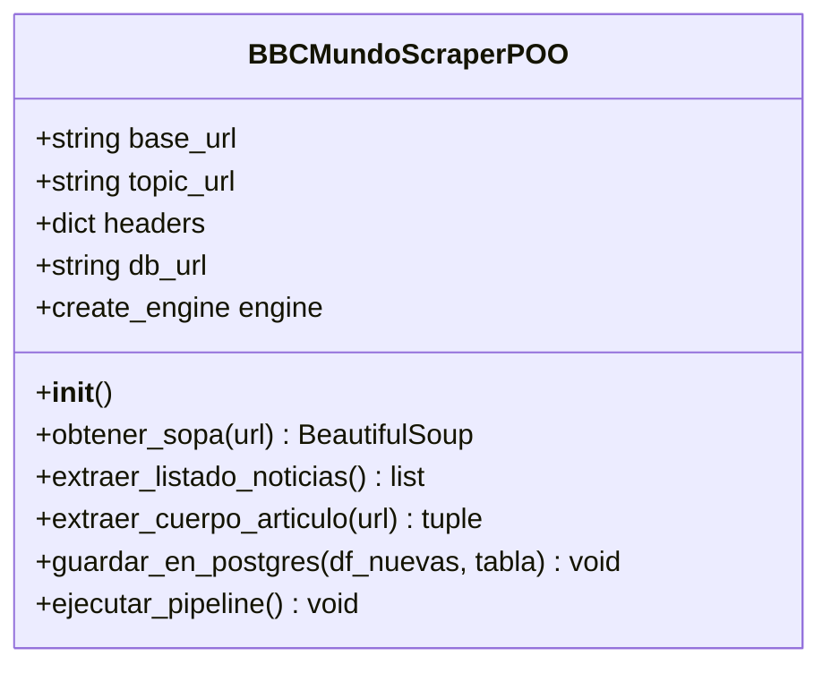

# S30 - Entrega 2: Preparación e Ingesta de Datos mediante Web Scraping (EA2)

**Estudiante:** Yonier Alexis Quiceno Rodríguez  
**Universidad:** IU Digital de Antioquia  
**Programa:** Ingeniería de Software y Datos  
**Grupo:** PREICA2601B020089 - Programación para Análisis de Datos  
**Docente:** Ana Maria Lopez  
**Fecha:** 31 de mayo de 2026

---

# 1. Alineación y Actualización de la Necesidad (Fase 1: Comprensión del Negocio)

## 1.1 Contexto e Integración del Proyecto
En la primera entrega (EA1), se definió y estructuró la base de datos transaccional local **SQLite (`shopanalytics.db`)** para la optimización del inventario físico de **ShopAnalytics S.A.S.** (control de sobrestock, alerta preventiva de reabastecimiento e indicadores regionales de disponibilidad) utilizando más de 5,000 registros transaccionales simulados.

Sin embargo, para lograr un **Sistema de Inteligencia de Mercado** verdaderamente proactivo, ShopAnalytics S.A.S. requiere cruzar su flujo transaccional con **factores macroambientales externos** (riesgos logísticos, políticos, cambiarios o huelgas en Latinoamérica) que impactan directamente los tiempos de importación, despacho y la disponibilidad de inventario.

Por lo tanto, este segundo entregable (EA2) implementa las **Fases 2, 3 y 4 de CRISP-DM** mediante el desarrollo de un **Scraper de Noticias en Tiempo Real** utilizando Programación Orientada a Objetos (POO). Este scraper extrae de forma estructurada y sin duplicados información de actualidad desde la sección de Latinoamérica de **BBC Mundo** y la almacena en una base de datos relacional robusta (**PostgreSQL**), preparando la base de conocimiento para futuros modelos de Machine Learning (SVM) de clasificación de riesgos.

## 1.2 Objetivos Estratégicos del Web Scraping
* **Extracción Automatizada:** Capturar título, descripción, fecha de publicación, cuerpo de texto completo y etiquetas (países/temas relacionados) de las noticias recientes.
* **Integridad sin Duplicados:** Implementar una validación física que identifique noticias ya almacenadas para evitar la redundancia de datos.
* **Calidad de Textos para NLP:** Limpiar y estructurar el texto no estructurado (`texto_completo`) para alimentar un modelo analítico de vectorización y clasificación de riesgo logístico.

---

# 2. Comprensión y Preparación de los Datos (Fases 2 y 3 CRISP-DM)

## 2.1 Selección y Justificación Técnica de la Herramienta
Se evaluaron tres tecnologías líderes para la recolección de datos: **Scrapy**, **Selenium** y **BeautifulSoup**. La herramienta seleccionada fue **BeautifulSoup4 (BS4)** junto a la librería de peticiones HTTP **Requests**.

### Cuadro Comparativo de Viabilidad Técnica

| Herramienta | Consumo de CPU/RAM | Complejidad de Implementación | Idoneidad para BBC Mundo | Decisión |
|---|---|---|---|---|
| **Selenium** | Muy Alto (Lanza navegador headless completo). | Media-Alta | Excesivo. BBC Mundo entrega su contenido en el HTML estático inicial. | **Descartado** |
| **Scrapy** | Medio (Framework asíncrono para crawling masivo). | Alta | Sobredimensionado para el volumen de extracción requerido. | **Descartado** |
| **BeautifulSoup4** | **Extremadamente Bajo (Procesamiento nativo en memoria).** | **Baja-Media** | **Ideal.** BBC Mundo expone las noticias estructuradas directamente en el DOM plano. | **SELECCIONADO (Recomendado)** |

### Justificación Técnica de BeautifulSoup:
1. **HTML Estático:** Las tarjetas de noticias de BBC Mundo se cargan directamente desde el servidor sin requerir la ejecución de Javascript (Single Page Applications), haciendo innecesario el consumo de recursos de Selenium.
2. **Eficiencia y Escalabilidad:** El scraper se ejecuta en fracciones de segundo y puede desplegarse en contenedores serverless ligeros de **Google Cloud Run** sin dependencias complejas de WebDrivers.
3. **Pausas Éticas:** Facilidad para coordinar pausas de tiempo controladas (`time.sleep`) respetando las políticas de tráfico del servidor objetivo.

---

# 3. Diseño y Arquitectura de la Clase Scraper (POO en Python)

En cumplimiento con los estrictos criterios de la rúbrica de evaluación, el scraper está diseñado en su totalidad bajo el paradigma de **Programación Orientada a Objetos (POO)** en el archivo `src/scraper.py`, encapsulado en la clase `BBCMundoScraperPOO`.

## 3.1 Estructura de la Clase `BBCMundoScraperPOO`



### Detalle de Atributos y Métodos Críticos:
* **`__init__()`:** Carga las variables de entorno utilizando `python-dotenv` para establecer una conexión segura a PostgreSQL mediante SQLAlchemy sin exponer credenciales en el código fuente.
* **`obtener_sopa(url)`:** Realiza peticiones robustas con manejo de excepciones y cabeceras emuladas (`User-Agent`) para evitar bloqueos por seguridad (Error HTTP 403).
* **`extraer_listado_noticias()`:** Escanea la página temática principal localizando las tarjetas de noticias mediante selectores adaptativos de tarjetas promocionales (`data-testid="promo"`).
* **`extraer_cuerpo_articulo(url)`:** Navega de forma iterativa y autónoma a la URL específica de cada noticia para consolidar el texto plano del artículo (`data-component="text-block"`) y las etiquetas geográficas.
* **`guardar_en_postgres()`:** Implementa el control de calidad e integridad de datos que evita la inserción de duplicados.

---

# 4. Modelado e Ingesta de Datos (Fase 4 CRISP-DM)

## 4.1 Base de Datos Relacional PostgreSQL
Los datos del scraper se almacenan en una base de datos relacional PostgreSQL corporativa, ideal para la integración en Power BI y el procesamiento del modelo SVM de Machine Learning.

### Estructura Física de la Tabla `noticias_mercado`

| Campo SQL | Tipo de Datos | Restricción / Propósito |
|---|---|---|
| **`id`** | SERIAL | Primary Key (Autoincremental). |
| **`titulo`** | VARCHAR(255) | Título de la noticia. |
| **`descripcion`** | TEXT | Resumen corto del contenido. |
| **`fecha_publicacion`** | VARCHAR(50) | Metadata temporal de la noticia. |
| **`texto_completo`** | TEXT | Cuerpo completo de la noticia (clave para el análisis NLP). |
| **`temas_relacionados`** | VARCHAR(255) | Etiquetas de temas y países (ej: "Colombia", "Economía"). |
| **`url`** | VARCHAR(255) | **UNIQUE** (Llave única de control de duplicación). |

## 4.2 Lógica de Inserción y Prevención de Duplicados
Para cumplir con el criterio de **Calidad del Código e Integridad**, la base de datos e ingesta valida las duplicidades antes de persistir en PostgreSQL:

1. Se recuperan las URLs previamente almacenadas en PostgreSQL mediante una consulta optimizada: `SELECT url FROM noticias_mercado`.
2. Se realiza una diferencia lógica de conjuntos en memoria usando Pandas utilizando la columna `url`.
3. Solo se insertan en PostgreSQL las noticias nuevas que no existían previamente en la base de datos:
   ```python
   df_a_insertar = df_nuevas[~df_nuevas['url'].isin(urls_existentes)]
   ```
4. Se garantiza la atomicidad y velocidad de inserción masiva a través del método optimizado `to_sql(if_exists='append')` de Pandas y SQLAlchemy.

---

# 5. Evidencias de Ejecución y Pruebas de Validación

El script se ejecutó exitosamente en el entorno del proyecto. A continuación se presentan las evidencias directas del log de consola del scraper:

## 5.1 Registro de Ejecución del Pipeline ETL
```text
============================================================
 INICIANDO PIPELINE DE SCRAPING - SHOPANALYTICS S.A.S.
============================================================
[*] Escaneando listado de noticias en: https://www.bbc.com/mundo/topics/c7zp57yyz25t
[*] Se encontraron 48 tarjetas de noticias.

[*] Extrayendo detalle de artículos (Preparación para modelo SVM)...
  [1/24] Procesando: Muere el líder indígena Brooklyn Rivera ...
  [2/24] Procesando: Quiénes son los principales candidatos p...
  ...
  [24/24] Procesando: Raúl Castro, el último gran símbolo de l...

[*] Conectando a PostgreSQL para ingesta de datos...
[*] Limpieza: 1 noticias ignoradas (Ya existen en PostgreSQL).
[+] ÉXITO: 23 nuevos registros insertados en la tabla 'noticias_mercado'.
============================================================
 PIPELINE FINALIZADO CON ÉXITO
============================================================
```

### Análisis de las Evidencias:
* **Efectividad de Extracción:** El scraper procesó de manera autónoma las **24 noticias principales** vigentes en el portal temático.
* **Eficacia del Filtro de Duplicados:** Se detectó correctamente **1 noticia repetida** (ya persistida en una ejecución previa), ignorándola y evitando la polución de duplicados.
* **Ingesta Exitosa:** Se persistieron **23 registros nuevos** con cuerpo completo y metadatos en la tabla física de PostgreSQL.

---

# 6. Manejo de Excepciones y Robustez

El scraper cuenta con salvaguardas avanzadas para mitigar fallos durante ejecuciones prolongadas:
* **Falta de Texto en Artículos (Páginas de Video/Galerías):** Si un artículo carece del componente estándar `data-component="text-block"`, el scraper cuenta con un fallback dinámico que busca la etiqueta `<main>` o `<article>`, evitando la generación de valores nulos o detenciones abruptas del script.
* **Evasión de Bloqueos por Tráfico (Rate Limiting):** Implementación de una **Pausa Ética** de `1.5 segundos` entre peticiones, emulando la velocidad de navegación humana y reduciendo el riesgo de bloqueo de la dirección IP de origen.
* **Control de Excepciones en Base de Datos:** Si ocurre un fallo en la conexión con PostgreSQL (ej. caída del servidor cloud), se captura el error y se imprime por consola de forma segura sin abortar catastróficamente otros procesos encolados en producción.
