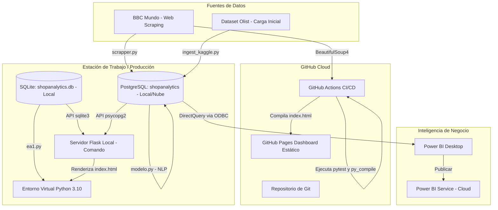

# Guía de Configuración Manual y Despliegue

Esta guía detalla las configuraciones externas (GitHub, PostgreSQL, Power BI) que el desarrollador debe realizar manualmente para alinear el proyecto **ShopAnalytics S.A.S.** con los requerimientos corporativos y de automatización.

## 1. Diagrama de Arquitectura de Despliegue



## 2. Configuración en GitHub y GitHub Pages (Multi-Ambiente y CI/CD)

Para lograr un flujo de despliegue continuo (CD) estructurado en la arquitectura Medallion, donde el dashboard estático generado por DuckDB/Plotly se valide y despliegue automáticamente de acuerdo al ambiente correspondiente:

### Paso 2.1: Sincronizar el repositorio y crear las ramas de desarrollo
El proyecto utiliza un flujo de tres ramas principales: `dev` (desarrollo), `qa` (pruebas de calidad) y `main` (producción).
1. Configura la rama principal local como `main`:
   ```bash
   git branch -M main
   ```
2. Sincroniza con tu repositorio de GitHub:
   ```bash
   git remote add origin https://github.com/<TU_USUARIO>/shopanalytics.git
   git push -u origin main
   ```
3. Crea y sube las ramas `dev` y `qa` necesarias para el flujo de promoción:
   ```bash
   # Crear y subir dev
   git checkout -b dev
   git push -u origin dev

   # Crear y subir qa
   git checkout main
   git checkout -b qa
   git push -u origin qa

   # Regresar a main
   git checkout main
   ```

### Paso 2.2: Crear los Ambientes en GitHub (Manual)
GitHub Actions utiliza entornos (Environments) para aplicar configuraciones específicas de despliegue:
1. En tu repositorio de GitHub, ve a **Settings** (Configuración) > **Environments** (menú lateral izquierdo, sección *Security*).
2. Haz clic en **New environment** (Nuevo ambiente) y crea un ambiente llamado `development`.
3. Repite el proceso y crea el ambiente `qa`.
4. Repite una vez más para crear el ambiente `production`.

### Paso 2.3: Activar GitHub Pages con GitHub Actions (Manual)
Para que el pipeline de CD pueda desplegar el dashboard directamente sin usar ramas intermedias (como `gh-pages`):
1. Ve a **Settings** > **Pages** (menú lateral izquierdo, sección *Code and automation*).
2. En la sección **Build and deployment > Source**, selecciona **GitHub Actions** en el menú desplegable (en lugar de *Deploy from a branch*).
3. No es necesario seleccionar nada más. El flujo de CD nativo en `.github/workflows/cd.yml` se encargará de configurar y publicar el sitio automáticamente en cada push a `main`.

### Paso 2.4: Configurar la Protección de Ramas (Opcional)
Si deseas garantizar que nadie realice cambios directos en las ramas del pipeline sin antes pasar por el flujo de Pull Request y validación de CI, puedes configurar esto (aunque para pruebas individuales no es estrictamente necesario):
1. Ve a **Settings** > **Branches** (menú lateral izquierdo, sección *Code and automation*).
2. En la sección **Branch protection rules**, haz clic en **Add branch protection rule** (Añadir regla de protección de rama).
3. Configura la regla para la rama `main`:
   - **Branch name pattern:** `main`
   - Activa **Require a pull request before merging** (Requerir un pull request antes de fusionar).
   - Activa **Require approvals** y selecciona `1` en el número de aprobaciones requeridas.
   - **IMPORTANTE:** Deja **desactivada** la opción *Do not bypass the above settings* (enforce_admins).
4. Haz clic en **Create** (Crear).
5. Repite el mismo proceso (pasos 3 y 4) creando una regla para la rama `dev` y otra para la rama `qa`.

### Paso 2.5: Funcionamiento de los Pipelines de CI/CD
El proyecto cuenta con dos flujos de trabajo totalmente automatizados:
1. **Integración Continua (`.github/workflows/ci.yml`):**
   - Se dispara en cualquier **Pull Request** hacia `dev`, `qa` o `main`.
   - Se encarga de levantar el entorno, instalar dependencias, realizar linting con `flake8`, comprobar la sintaxis de todos los archivos del scraper/NLP con `py_compile` y ejecutar las pruebas unitarias con `pytest`.
2. **Despliegue Continuo (`.github/workflows/cd.yml`):**
   - Se dispara en cualquier **Push** o fusión directa a `dev`, `qa` o `main`.
   - **Push en `dev`:** Ejecuta el pipeline ETL de DuckDB simulado para el ambiente de `development`.
   - **Push en `qa`:** Ejecuta el pipeline ETL y genera el dashboard interactivo simulado para el ambiente de `qa`.
   - **Push en `main`:** Ejecuta el pipeline completo, genera el reporte en `output/index.html` y lo despliega a **GitHub Pages** de forma nativa utilizando el ambiente de `production`.


## 3. Configuración de Base de Datos PostgreSQL

### Paso 3.1: Configuración Local
1. Descarga e instala **PostgreSQL** (versión recomendada 14+). Durante la instalación, recuerda la contraseña del usuario `postgres`.
2. Crea un archivo `.env` en la raíz de tu proyecto (este archivo será ignorado por Git por seguridad):
   ```ini
   DB_HOST=localhost
   DB_PORT=5432
   DB_NAME=shopanalytics
   DB_USER=postgres
   DB_PASSWORD=tu_contraseña_aqui
   ```
3. Ejecuta el archivo de inicialización para crear las bases de datos:
   ```powershell
   .\01_instalacion_inicial.bat
   ```

## 4. Creación del Tablero Analítico en Power BI

La gerencia no mira bases de datos; mira métricas. Construirás un tablero integrando la inteligencia del modelo NLP.

### Paso 4.1: Conexión mediante DirectQuery
1. Abre **Power BI Desktop**.
2. Ve a **Obtener Datos** > **Base de datos de PostgreSQL**.
3. Ingresa `localhost` como servidor y `shopanalytics` como base de datos.
4. Selecciona **DirectQuery** en el modo de conectividad de datos. Esto garantizará que Power BI siempre consulte los datos más recientes del NLP, sin tener que importarlos a la memoria local.
5. Inicia sesión con tus credenciales (Usuario: `postgres`, Contraseña: tu contraseña).
6. Selecciona la vista `vw_riesgo_logistico`.

### Paso 4.2: Diagramación del Tablero
Agrega las siguientes visualizaciones a tu lienzo:

*   **Gráfico Circular (Doughnut Chart):**
    *   **Leyenda:** `categoria_riesgo`
    *   **Valores:** Recuento de `titulo`
    *   *Propósito:* Identificar si el riesgo actual del mercado es geopolítico, financiero u operativo.
*   **Gráfico de Barras Agrupadas:**
    *   **Eje Y:** `temas_relacionados` (Top 5)
    *   **Eje X:** Recuento de `titulo`
    *   *Propósito:* Monitorear los países y tendencias específicas con mayor volumen de noticias de alerta.
*   **KPI de Gravedad (Semáforo):**
    *   Crea una medida DAX para medir el impacto global del día y asígnala a un medidor o tarjeta coloreada basada en el `nivel_riesgo` (Alto = Rojo, Medio = Amarillo, Bajo = Verde).

### Paso 4.3: Publicación (Opcional)
Haz clic en **Publicar** en el panel superior para subir tu tablero a Power BI Service y compartir los resultados a toda la organización S.A.S.
